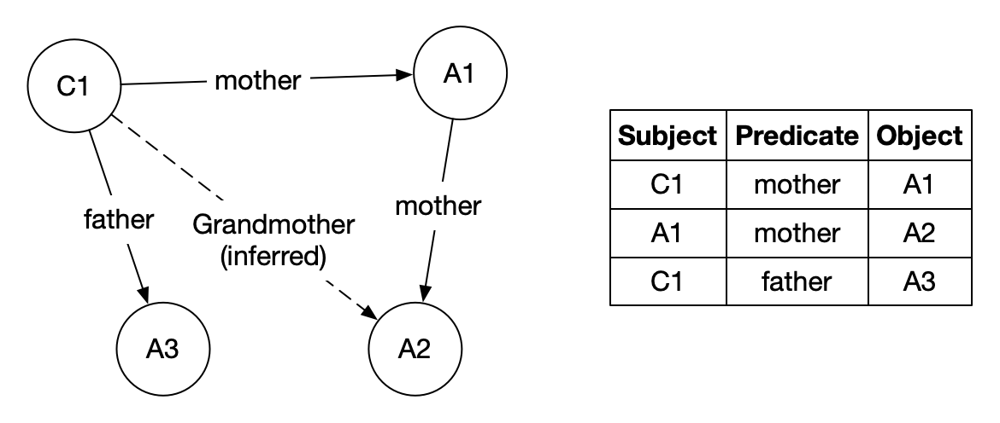

Polymorphism via dispatch
=========================
(IN DRAFT)

Note: This section is expected to supercede the discussion on :doc:`objects`.

When writing our procedures/functions in a programming language, we deal with
different data structures and entities such as files, network sockets and
processes. For any given system, a number of such entities serves as its "API"
or "Application Programming Interface". If each of these entities were to be
transacted with using its own vocabulary, it will become very hard for
programmers to retain the vocabularies necessary to work with a practical
subset of these entity types in working memory so they act of programming is
both efficient and reliable.

Thankfully, many of these entities can be worked with using a much smaller set
of "verbs" using which programmers typically chunk their thinking about them.
For example, both hash-tables and vectors in Racket offer the notion of
associating a value with a key. Only, in the case of hash-tables, the key can be
anything "hashable" whereas in the case of a vector, the key must be in the
range :math:`[0,N)`. However, the act of getting a value associated with a
particular key can simply be thought of across all such data structures using
the verb "get" and similarly the setting of a value against a particular key can
be thought of using the verb "set".

For an analogy, consider the Harry Potter world and Hermione Granger's timely
use of the spell "Alohamora" to open a lock. Suppose that in the wizarding
world, each kind of lock required a different spell to be learnt to open it --
"Alohamora Big One", "Alohamora 42", "Alohamora Locksmith & Sons Tiny 2021
edition" and so on -- wizards might give up pretty soon. But we have a hint
here -- that the word "Alohamora" suggests that the lock needs to be opened,
and the ones programming these locks can determine what to do when the lock
hears the spell "Alohamora", instead of making custom spells for it. This would
then obviously be preferrable for wizards (and students!) since they would then
need to remember far fewer spells overall to be effective in their world.

Racket library functions kind of work as though they were in that complicated
world of spells. In Racket, though you'll find procedures named according to
such common vocabulary, each data structure carries its own set of procedures
to work with it. So vectors come with ``vector-ref`` and ``vector-set!`` and
``vector-length``, and similarly hash-tables have ``hash-ref``,
``hash-set!`` and ``hash-count``. If we were to invent another data
structure, say, ``treemap``, then we'll have to expose yet more procedures
named ``treemap-ref``, ``treemap-set!`` and ``treemap-length`` that will do
analogous things with tree maps. If we choose completely different vocabularies
-- say, ``treemap-search-and-retrieve``, ``treemap-find-and-replace`` and
``treemap-count-entries`` -- we'd place a huge cognitive burden on programmers
who'd want to adopt our new data structure since they cannot reuse their
vocabulary in the new context.

What if we could simply say ``ref``, ``set!`` and ``length`` and when we
introduce a new data structure, be able to declare how these verbs should work
with it at that point? That way, if we have a vector ``v``, we reference its
``k``-th element using ``(ref v k)`` and if we have a hashtable ``h`` and a key
``k``, we can get its associated value using ``(ref h k)`` as well, instead of
``(hash-ref h k)``. It is quite evident that the cognitive burden is lower for
such a unified concept of "``ref``-ing" a value. This "reuse of verbs" with
different objects is the essence of "polymorphism".

While doing this makes for concise code while writing, we also notice that when
reading code, ``(ref h k)`` tells us very little about ``h`` than "something we
can call ``ref`` on", whereas ``(hash-ref h k)`` is amply clear. This is part
of the reason for that design choice to be explicit in the Scheme/Racket
languages. The goal of a program is only partly to instruct machines (such as
"locks") but equally to communicate "how to" knowledge to other humans.

.. admonition:: **Terminology**

    Such a multi-purpose definition of a verb like ``ref`` and ``set!`` is
    referred to in programming languages as "polymorphism" and the verb is said
    to be "polymorphic" over a collection of types.

Exploring through "property lists"
----------------------------------

We'll explore the design space of object oriented programming languages
through a basic structure called a "property list", which we'll assume
that our interpreter has access to at any point (i.e. globally).

A property list is a simple structure that asserts connections between
"subjects", "objects" (not to be confused with "object" in the OOP sense, but
linguistic "object") via "predicates". For example, the triple ``(Tri
child23 'mother adult42)`` establishes that the ``'mother`` of
``child23`` is ``adult42``. This relationship can be thought of as a
labelled arrow from the child to the adult. This way, arbitrary graphs can be
represented using such a triple store.

         a node representing a child and three nodes
         representing adults related to the child.

   A triple store can be seen as a graph.

We'll now model several "object orientedness" ideas based on such a triple
store. Note that this is not to say that such a triple store is what is
backing the various object systems. Far from it. We're using the plist as a
way to explore the design space and options we have when we're interested in
minimizing the vocabulary we use to program.

The complete "global plist" module is given below for your use. Save it
in ``plist.rkt`` and ``(require "./plist.rkt")`` to use it.

.. code:: racket

    #lang racket

    (provide getprop getprops putprop! remprop! remprops!)

    ; Global mutable plist for simplicity
    (define p '())

    (struct triple (sub pred obj) #:transparent)

    ; Gives the associated "object" if available,
    ; or #f if not found.
    (define (getprop sub pred)
      (let loop ([ts p])
        (if (empty? ts)
          #f
          (let ([t (first ts)])
            (if (and (eq? (triple-sub t) sub)
                     (equal? (triple-pred t) pred))
              (triple-obj t)
              (loop (rest ts)))))))

    ; Retrieves all the associated "objects".
    (define (getprops sub pred)
      (let loop ([ts p] [vs '()])
        (if (empty? ts)
          (reverse vs)
          (let ([t (first ts)])
            (loop (rest ts)
              (if (and (eq? (triple-sub t) sub)
                       (equal? (triple-pred t) pred))
                (cons (triple-obj t) vs)
                vs))))))

    ; Adds an association.
    (define (putprop! sub pred obj)
      (set! p (cons (triple sub pred obj) p)))

    ; Removes a specific association.
    (define (remprop! sub pred obj)
      (set! p (filter (λ (t)
                        (not (and (eq? (triple-sub t) sub)
                                  (equal? (triple-pred t) pred)
                                  (eq? (triple-obj t) obj))))
                      p)))

    ; Removes all assocations with the given predicate label.
    (define (remprops! sub pred)
      (set! p (filter (λ (t)
                        (not (and (eq? (triple-sub t) sub)
                                  (equal? (triple-pred t) pred))))
                      p)))

          
We'll assume that we're working with a global plist. Furthermore, we'll
dispense with implementing it in our language's interpreter and do it in
plain Racket, since the translation process should now be familiar and
simple to perform.

We'll also define a simple structure to make object references.
We'll give it an ``id`` field so when printing out an object, we
know its name. There is no other significance to this ``id`` field.

.. code-block:: racket

    (require "./plist.rkt")

    (struct Obj (id) #:transparent)

A prototype based object system
-------------------------------

The ``Self`` language pioneered the idea of a prototype based object system.
Historically, this came after the class based system adopted by ``Smalltalk``,
as a response to the problem of having to determine an application's
architecture based on "classes" that aren't necessary known up front and will
be discovered along the way. In other words, the prototype based system was
seen as a way to **evolve** software as requirements come in during its
development. The object system in ``JavaScript`` is based on these ideas
developed in ``Self``.

So, what is an "object" in such a system in the first place? In such a
prototype based system, an object is simply a collection of named properties
and "methods". A "message" to an object involves a "message name" (a.k.a.
"selector") and some additional arguments. When a message is "sent" to an
object, it looks up a corresponding method (in a table), which is a procedure
and calls the procedure with the given message arguments. Methods also need to
get a reference to the object as well, so they can access other properties and
methods they need.

.. admonition:: **Objects and state**

    Note the change of language we're faced with when looking at such "objects"
    -- in particular, we're using an imperative language as though the object
    has some internal storage that we can only influence through message
    passing and it is free to do anything with that internal data in response
    to messages. This "state encapsulation" is a significant by product of
    object think. There is no reason to choose a dominantly object based design
    for a system unless it requires and exploits such state encapsulation to
    using and reasoning about the system.

So we'll make a simple function to which we can give a list
of keys and values (including method procedures) and get an object
reference that is associated with those properties and methods.

.. code-block:: racket

    (define (object id . kvs)
      (let ([obj (Obj id)])
        (let loop ([kvs kvs])
          (if (empty? kvs)
            obj
            (let ([key (first kvs)]
                  [val (second kvs)])
              (when (not (symbol? key))
                (error 'object "Key is expected to be a symbol. Got ~a" key))
              (putprop! obj key val)
              (loop (rest (rest kvs))))))))

With that definition in hand, we can do the following -

.. code-block:: racket

    (define dog1 
      (object 'puppy
        'color 'brown
        'bark (λ (self) (displayln "Yelp!"))))

    (define dog2
      (object 'adult
        'color 'black
        'bark (λ (self) (displayln "Woof Woof!"))))

    (define cat1
      (object 'siamese
        'color 'grey
        'bark (λ (self)
                 (error "I don't bark! Am I a dog?"))))

    > (getprop cat1 'color)
    'grey
    > (getprop dog2 'color)
    'black

Now, what does it mean to send an object a message? In our case,
we're modelling "message passing" as "method invocation". So we
need to take the message name, look it up in the property list
against the object, and call the function associated. For now,
we'll leave the "no such method" condition as an error.

.. code-block:: racket

    (define (get obj propname)
      (or (getprop obj propname)
          (error "Placeholder. Property name not found")))

    (define (send obj msgid . args)
        (let ([method (get obj msgid)])
            (if (procedure? method)
                (apply method obj args)
                (error "Method must be a procedure"))))

Now we can make our animals make noises -

.. code-block:: racket

    > (send dog1 'bark)
    Yelp!
    > (send dog2 'bark)
    Woof Woof!

Note that the objects are doing something different though
both have been asked to "bark". This is pretty much the whole
value behind object oriented programming. Objects are able
to do this because they encapsulate state in the form of
properties.

Now, notice that the ``cat1`` object errors out when asked
to bark. However, we may think of both cats and dogs as 
"four legged animals". Let's make an ``animal`` object that
represents this idea -

.. code-block:: racket

    (define animal (object 'Animal
                        'num-legs 4))

Now, we'd like to have our cats and dogs respond to a request
for ``'num-legs`` with 4. We can of course add these properties
to each of those objects, but that feels redundant.

Here is where the "Placeholder" gains importance. We left open
the question of what to do when a property is not found. We
can now exploit that gap by asking another linked object for
the property. But which other object? For that, we can look
it up in the property list.

.. code-block:: racket

    (define (get obj propname)
      (or (getprop obj propname)
          (get (or (getprop obj 'prototype)
                   (error 'get "Thing has no prototype ~a" obj))
               propname)))

We did something interesting there. We first try to look up a "prototype" property
of the object, which we expect to be defined to another object. If we find one,
we then ask that object for the property. If such a "prototype object" doesn't
exist, the ``getprop`` will error out. But if it does, it will be as though our
object gained the properties of that "prototype object". Now, when getting the
property of the "prototype", we do it recursively so that if that "prototype" also
didn't have that property or method, we look up its "prototype" and so on until
either the property/method is found or it errors out.

Note that we've again left a placeholder for the condition when the "prototype" of
an object cannot be found. We'll return to this choice point later. First let's
see what this mechanism buys us for our animal farm.

.. code-block:: racket

    (putprop! dog1 'prototype animal)
    (putprop! dog2 'prototype animal)
    (putprop! cat1 'prototype animal)

    > (get dog1 'num-legs)
    4
    > (get cat1 'num-legs)
    4
    
We can now also add a method dynamically to ``animal`` and all the
animals will automatically get it.

.. code-block:: racket

    (putprop! animal 'walk 
      (λ (self num-steps)
        (or (getprop self 'steps-walked)
            (putprop! self 'steps-walked 0))
        (putprop! self 'steps-walked
          (+ (get self 'steps-walked) num-steps))))

    > (send dog1 'walk 3)
    > (get dog1 'steps-walked)
    3
    > (send dog1 'walk 5)
    > (get dog1 'steps-walked)
    8

It's tiring
-----------

Now, imagine the process we went through just got bigger with many
tens of methods and properties. Every time we make a new object -- an
animal -- we have to define these properties on each of them. The
ability to delegate commonly accessed methods to such a "prototype"
object like we just did is therefore a boon since we can just accumulate
those common methods in that "prototype" object and make the other objects
just reference it via their ``'prototype`` property.

This is the essence of how "classes" are modelled in prototype based object
systems. The "prototype object" of an object is known as the object's "prototype".
In such systems, a prototype that also has a method that can construct 
"instances" of it is referred to as a "class".

Such prototype based systems do not really distinguish between the notions of
"object methods" versus "class methods", since these "classes" are themselves
objects and when you send a message via the object, the method actually affects
the object in question and not its class, unless you make the class the target
of the message send. This is due to the methods taking the object as their
first argument usually named ``self``, as with Python or ``this`` as with 
JavaScript.

Class methods
-------------

In order to distinguish between "class methods" (methods that operate on the
class) versus "object methods" (methods that operate on the object that
inherits properties and methods from the class), we therefore need to
make that distinction available in the message sending procedure.

So far, we only added the ``self`` argument. In the ``send`` procedure, we
first lookup the message in the object hierarchy and then invoke the method on
the object. If we separate the two, we gain the ability to use the methods in
one object and apply then on another. To keep the generality, we need to
augment our method argument list with the object we use to lookup the method as
well so that the method can do what it pleases with that information. The
effect of this is only relevant when we have deeper and/or broader class
hierarchies though.

.. code-block:: racket

    (define (method m)
      (if (procedure? m)
          m
          (error 'method "Expected a method. Got ~a" m)))

    (define (send* klass obj msgid . args)
      (let ([m (method (get klass msgid))])
        ; Note the change in protocol for method invocation
        ; which now takes an additional "klass" argument.
        (apply m klass obj args)))

    ; Note that in class-based object systems, method lookup
    ; starts with an object's class and not the object itself.
    ; So we need to lookup an object's ``'isa`` property and
    ; and invoke ``send*``.
    (define (send obj message . args)
      (apply send* (getprop obj 'isa) obj msgid args))

    (define dog1 
      (object 'puppy
        'color 'brown
        'bark (λ (klass self) (displayln "Yelp!"))))

    (define dog2
      (object 'adult
        'color 'black
        'bark (λ (klass self) (displayln "Woof Woof!"))))

    (define cat1
      (object 'siamese
        'color 'grey
        'bark (λ (klass self)
                 (error "I don't bark! Am I a dog?"))))

    (define animal 
      (object 'Animal
        'num-legs 4
        'walk (λ (klass self num-steps)
                (putprop! self 'steps-walked
                  (+ (get self 'steps-walked) num-steps)))))

So what new capability does doing this give us? Within a method,
we can now delegate a part of the functionality to the "prototype" 
if we wish. For example, if we want to make a custom "walk" method
for the cat that depends on whether it is tired, we can do this -

.. code-block:: racket

    (putprop! cat 'tired #t)
    (putprop! cat 'walk
        (λ (klass self num-steps)
            (if (get self 'tired)
                (error "No energy for a walk. Go away. Meeeow!")
                (send* (get klass 'super) self 'walk num-steps))))

Notice how the cat delegates to its super the ability to walk when it is able
to, but errors out otherwise. Under normal method invocation, ``klass`` will be
the same as ``self``'s ``'isa`` property, but we can choose differently, just
as the method does when turning around and invoking the parent implementation
directly, but without changing the target object.

Classes and Types
-----------------

We saw how the concept of a class arises in a prototype based object
system -- mostly to collect a group of related methods that apply
to a set of objects that are said to be "instances" of the same idea.
In our example, the dogs and the cat were instances of "animal".

Due to this correspondence, such a delegate object (which we called "super")
can be thought of as the "type" of the object. Languages like C++ and Java
which are class based often take this approach. In these languages,
a class acts like a factory for objects which imbues the objects it
creates with a consistent set of properties and methods.

We can pretty much use the same ``get`` algorithm with naming the 
property lookup ``class`` instead of ``super`` and it will start
to look like a class based object system. In such systems though,
the relationship between an object and its class is deemed to be
an "is-a" relationship and it is the class which has a hierarchy
and not the object. When an object is created, it is created with
"slots" for its properties and the methods are all grouped within
the class. The object itself does not maintain a table of methods
but delegates method lookup to its class. We can model this structure
like below --

.. code-block:: racket

    (define (get thing propname)
      (or (getprop thing propname)
          (get (or (getprop thing 'super)
                   (error 'get "Thing doesn't have a super"))
               propname)))

    (define (send obj msgid . args)
      (apply send* (getprop obj 'isa) obj msgid args))

Uniformity considerations
-------------------------

We saw that "pure" OOP systems tend to say "everything is an object"
and that "everything happens via message passing". This includes languages
like Smalltalk, Self and Ruby. Here is, for example, how such a system
might handle branching on a condition.

.. code-block:: racket

    (putprop! 'True 'if:else: (λ (ctxt obj thenblock elseblock)
                                    (send thenblock 'invoke)))
    (putprop! 'False 'if:else: (λ (ctxt obj thenblock elseblock)
                                    (send elseblock 'invoke)))

So the result of a boolean computation is a singleton instance of one of the
"classes" named ``True`` and ``False``, which dispatch on the ``'if:else:``
message on one or the other branch depending on which instance received the
message. Note how this bears close resemblance to the way we encoded booleans
in lambda calculus.

Other control constructs are also cleverly constructed based on the fundamental
notion of a "block" - which plays the role of a lambda function in OOP
languages like Ruby and Smalltalk, and are "ordinary" first class functions in
languages like JavaScript and Python. For example, a block object could have
a method named ``whileTrue:`` which takes another block and runs it repeatedly
until the target block returns with ``False``.

What about ordinary numbers then? Should we declare each number used in the
system to have a property list entry that gives it "class"? That would be terribly
wasteful and impractical to do so. So these systems use a few bits in small
data types like numbers to tell their types, as an implementation hack. In
principle, that is equivalent to having some type checks like below --

.. code-block:: racket

    (define (key-not-found thing key)
      (error 'get "Thing ~a does not have key ~a" thing key))

    (define (get0 thing key [else key-not-found])
      (or (getprop thing key)
          (get0 (or (getprop thing 'super)
                    (else thing key))
                key
                else)))

    (define (get thing key [else key-not-found])
        (if (equal? key 'isa)
            (cond
                [(number? thing) 'Number]
                [(string? thing) 'String]
                [(symbol? thing) 'Symbol]
                [(boolean? thing) (if thing 'True 'False)]
                [else (get0 thing key else)])
            (get0 thing key else)))

    ; Some sample messages supported by these "types".
    (putprop! 'Number '+ (λ (klass self val) (+ self val)))
    (putprop! 'Number '- (λ (klass self val) (- self val)))
    (putprop! 'Number 'neg (λ (klass self) (- self)))
    (putprop! 'Number '* (λ (klass self val) (* self val)))
    (putprop! 'Number '/ (λ (klass self val) (/ self val)))
    (putprop! 'Number 'inv (λ (klass self) (/ 1 self)))
    (putprop! 'String 'concat (λ (klass self str)
                                 (string-append self str)))
    (putprop! 'String 'display (λ (klass self)
                                  (displayln self)))
    (putprop! 'True 'display (λ (klass self) (display "#t")))
    (putprop! 'False 'display (λ (klass self) (display "#f")))

    ; Now we can do
    (send 3 '+ 4) ; => 7

Now we no longer have to have individual raw data items like numbers and
strings in our property list just so we can get at their types/classes.
We can reference these properties and methods through their respective
classes.

Flipping things around
----------------------

We modelled message passing as method invocation using our ``send`` procedure
which we wrote like this (for prototype based inheritance).

.. code-block:: racket

    (define (send obj msgid . args)
        (apply (get obj msgid) obj args))

This puts the object in the centre of the stage and the message plays the role
of something that the object receives and then does something with. We can equivalently
write it as an ``invoke`` procedure like below, which puts the message
at the centre of the stage.

.. code-block:: racket

    (define (invoke method-name obj . args)
        (apply (get obj method-name) obj args))

They both do the same thing. But now we can ask an interesting question we
might not have asked with the earlier approach -- can we now determine which
method to call based on the types/classes of more than one object? This
situation arises often in scientific computing where "what to do" is often only
possible to know when the types of multiple entities are known -- such as how
to add a complex number to a real number or multiply a real number with a
vector, and so on.

.. code-block:: racket
    
    (define (typeof obj) (getprop obj 'type))

    (define (invoke2 method obj1 obj2)
        (apply (getprop method (map typeof (list obj1 obj2)))
            (list obj1 obj2)))

In ``invoke2`` above, we're treating the method as the thing for which
we're looking up properties against various nominal types (i.e. types by
names). [#eq]_ The key is a compound object in this case, a list of two types
(which could be symbols). We can now define methods for concatenating
strings and integers perhaps using this approach --

.. [#eq] Note that in ``getprop``, we used ``eq?`` to match the
   subject and ``equal?`` to match the predicate. The reason for that
   choice is that it enables us to use such "compound predicates"
   like the "list of types" we have in this case. ``eq?`` (roughly)
   checks for the references being the same, so ``(eq? '(1 2) '(1 2))``
   is ``#f``, whereas ``(equal? '(1 2) '(1 2))`` is ``#t``.

.. code-block:: racket

    (putprop! 'add (list 'Number 'Number)
        (λ (n1 n2)
            (+ n1 n2)))

    (putprop! 'add (list 'String 'Number)
        (λ (str num)
            (format "~a~a" str num)))

    (putprop! 'add (list 'Number 'String)
        (λ (num str)
            (format "~a~a" num str)))

Now we can add numbers and strings freely. Not that that's a good thing, but
we can.

The interesting thing about this approach is that we're no longer forced to
determine whether the code for adding a string with a number should go within
the class for strings or the class for numbers! However, it looks like we've
traded that flexibility for a whole lot of responsibility -- that of specifying
what procedure to use for potentially N^2 type combinations where N is the
number of types in the program. While the problem is not as dire as that, it
does get burdensome even dealing with special methods for combining various
types of numbers. But the payoff is simplicity for the programmer and that is
worth some of the additional work put in to ensure that method names have
consistent interpretations across various types.

This approach is also the essence of "multiple argument dispatch", which has
been in object systems as old as Common Lisp (in CLOS). We can obviously extend
this approach beyond just 2 arguments. Julia is a programming language in which
this notion of multiple argument dispatch, combined with type based method
specialization and just-ahead-of-time compilation is used to generate highly
efficient code for scientific computing applications. Julia gets around the
problem of having to specify special method implementations for multiple
combinations by permitting the definition of generic methods on which type
specialization at call time can produce concrete types and methods at all the
call points and therefore special methods that are consistent with the intent
of the verb can be generated on demand.  For example, consider the following
definition for a "squared distance" -

.. code-block:: racket

    (define (sqdist dx dy)
        (+ (* (adj dx) dx) (* (adj dy) dy)))

If we have implementations for different types for ``adj``, ``*`` and
``+``, this generic way of specifying a computation using those methods
suffices to produce a special implementation depending on the context.
For example, if ``dx`` and ``dy`` happened to be vectors, we can interpret
``sqdist`` to be equivalent to --

.. code-block:: racket

    (define (sqdist-vec-vec dx dy)
        ; where *-vec-vec acts like a dot product when
        ; given a row vector and a column vector.
        (+-vec-vec (*-vec-vec (adj-vec dx) dx)
                   (*-vec-vec (adj-vec dy) dy)))

    (define (sqdist-complex-complex dx dy)
        (+-complex-complex (*-complex-complex (adj-complex dx) dx)
                           (*-complex-complex (adj-complex dy) dy)))

    ; and so on.

The important simplifying procedure here is that these specialized methods
can be automatically generated from one (or more) generic specifications
depending on need. [#genmethods]_

.. [#genmethods] Providing an implementation of this is not simple and would
   fall into the scope of an advanced course that covers the required type
   systems and type inference mechanisms.

In the above ``invoke2`` procedure, we're doing dynamic dispatch over multiple
arguments. However, that is not necessary and it is possible to do some of this
analysis at compile time and determine which method procedures to call
statically ... which is a huge efficiency boost over determining it for every
pair of, say, numbers over and over again. While Julia can do dynamic dispatch
as a fallback, such a static dispatch is what it relies on for its performance.

In this approach, therefore, a "verb" does not correspond to a single procedure,
but to a family of related procedures called "methods" and which procedure to
use for a particular call is determined based on the types of the arguments
being passed to it.

Miscellaneous considerations
----------------------------

Initializing objects
~~~~~~~~~~~~~~~~~~~~

In class based object systems, an object is simply configured to refer to its
class for the methods and is allocated some memory "slots" to store its
properties. Usually though, each kind of object will need to be initialized
with the slots containing values that meet some specific constraints of
consistency. For example, a "Point2D" object may need to have its "x" and "y"
slots be initialized to 0. Such an initialization is done by a designated
method in the class called its "constructor". This "constructor" procedure is
run only once at object creation time and is not available for use in the
method invocation chain.

.. code-block:: racket

    (define (new klass . args)
        (let ([obj (Obj klass)])
            (putprop! obj 'isa klass)
            (apply (get klass 'constructor) (cons obj args))
            obj))

Note that some languages like Java and C++ enforce different calling forms for
constructors which won't permit constructor functions to be treated as methods.
This is a language design option and our implementation leaves this enforcement
to later. Python has ``__init__`` methods that serve this purpose that are
valid as ordinary methods. So it is not uncommon to treat a constructor like an
ordinary method as well.

Method not found
~~~~~~~~~~~~~~~~

Earlier, we had a case where we had a failure to lookup a method by name
and we errored out. We have another option - to rely on the property list
to figure out what to do! For example, if a "method-not-found" procedure is
defined for a type, we can call that to determine any dynamic actions to
perform. 

.. code-block:: racket
    
    (define (send obj msgid . args)
      (apply
          (get obj msgid
            (λ (obj msgid)
              (send obj 'method-not-found msgid)))
          obj
          args))
          

Examples from OOP languages
---------------------------

Javascript
~~~~~~~~~~

JS has a prototype based object system and mostly takes on an "everything is an
object" perspective. The following design that underlies the "class" syntax in
ES6 and above. Instead of the explicit ``self`` argument we've used in our model,
JS provides an implicit ``this`` within its function bodies.

The "constructor" function
--------------------------

.. code:: js

   function Klass(args...) {
     this.field1 = "initial value";
     this.field2 = 42;
   }
   Klass.prototype.method1 = function (args...) {
     console.log("Called Klass' method1");
     // ...
     return result;
   };
   Klass.prototype.method2 = function (args...) {
     // ...
     return result;
   };
   let obj1 = new Klass("one", 2, {three: 3});
   console.log(obj1.field2); // prints 42
   console.log(obj1.method1("param")); // prints "Called Klass' method1"

The special property of a ``Function`` object named ``prototype`` is itself
expected to be an object that contains a collection of methods that every
"instance" is supposed to get. This object is then set as the ``__proto__``
property of constructed ``Klass`` objects such as ``obj1`` above. When a
property or a method is specified using the ``a.b`` notation, the chain of
these ``__proto__`` objects is lookup for the definition -- i.e., ``a.b``,
``a.__proto__.b``, ``a.__proto__.__proto__.b`` and so on -- until one is found,
or erroring out if no such property or method can be found.

Python
------

Python takes a class based approach to specifying objects. As we know, a
"class" serves as a machine for making new objects with specific properties
determined by the class.

.. code:: python

   class Klass(ParentKlass):
      def __init__(self, args): # The constructor function
         self.field1 = "initial value"
         self.field2 = 42

      def method1(self, args):
         print("Called Klass' method1")
         # ...
         return result
      
      def method2(self, args):
         # ...
         return result

   obj1 = Klass("params")
   print(obj1.field2) # prints 42
   obj1.method1("params") # prints "Called Klass' method1"

Note that Python takes the approach of making the ``self`` argument explicit
like in our model implementations. Also Python does not have a ``new`` operator,
instead using the ``Klass`` itself like a function to construct new objects.

Since Python uses a class based object system, objects don't have "parent"
or "super" relationships, but classes do.

Objective-C
-----------

Objective-C has a Smalltalk lineage though it is embedded in C and therefore
uses the Smalltalk "message passing" notation. The runtime of Objective-C
is itself written in C using a small set of C functions like ``msgSend``.

.. code:: objc

    @interface Klass : NSObject
       id<String> field1;
       int field2;

       - id<Klass> initWithString: (id<String>) f1 number: (int) f2;
       - (id) method1: (int)arg;
       - (id) method2: (id)arg;
    @end

    @implementation Klass

    - id<Klass> initWithString: (id<String>) f1 number: (int) f2 {
      self.field1 = f1;
      self.field2 = f2;
      return self;
    }

    - (id) method1: (int)arg {
      printf("Called Klass' method1\n");
      return nil;
    }

    - (id) method2: (id)arg {
      // ...
      return nil;
    }

    @end
    
    id<Klass> obj1 = [[Klass alloc] initWithString:@"Hello" number:42];
    [obj1 method1:10]; // prints "Called Klass' method1"

Objective-C, like Smalltalk, also presents a class-based object system.
It splits the specification of a class into an "interface", which is declared
in ".h" header files and an "implementation" which is given in ".m" files.

You'd also notice that creating an object is separated into two phases --
allocation and initialization -- where the ``alloc`` message sent to the
``Klass`` object (yes, classes are also objects in ObjC just as in Smalltalk),
causes memory for the object to be allocated, and the ``initWithString:number:``
message sent to the newly allocated *uninitialized* object will initialize
its fields and make it ready for use. A class can therefore have more than
one kind of "initializer" and it is only by convention that the initialization
methods are named ``init...``.

Like Smalltalk, Objective-C objects have a linear class hierarchy - i.e. a
class can have only one parent, with the chain terminating in the built-in
``NSObject`` class. [#ns]_

.. [#ns] **Trivia**: The "NS" prefix in the ``Foundation`` package classes
   stands for "NextStep" -- the company founded by Steve Jobs after he was
   fired from Apple, but which Apple subsequently bought to make MacOSX.
   NextStep featured the object system in its dev kit that continues to be used
   in a far evolved form to this day in MacOS and iOS. NextStep featured the
   "Display PostScript" system which was also integrated into MacOS, giving it
   its signature "print to PDF" feature found ubiquitously in nearly all window
   based applications.

There is more to the object system, which supports formal and information
protocols, categories, ad hoc extensions to classes and so on, all of which are
characteristics of Smalltalk as well. You can also construct messages
themselves as objects and store them somewhere and send them dynamically at a
time of your choosing. This is not a characteristic of many "object oriented"
systems.

Java/C#/C++
-----------

Java, C# and C++ have similar class-based object systems. The main difference
between Java/C# and C++ is that references to objects cannot be faked in
Java/C#, making them "capability secure" whereas any pointer can be made to
pretend to be an "object" in C++, permitting various kinds of security
exploits.

.. code:: Java

   class Klass: Object {
      String field1;
      int field2;
    
      public Klass(String s, int i) {
        field1 = s;
        field2 = i;
      }

      public int method1(String s) {
        System.out.println("Called Klass' method1");
        return 0;
      }

      public String method2() {
        return "Hello";
      }
   }

   Klass obj1 = new Klass("Hello", 42);
   obj1.method1("Smoke testing");

C# and C++ are conceptually similar in many ways, though slightly different in syntax,
with C# being closer to Java.

An important distinction between these languages is that C++ features multiple inheritance
which brings with confusions such as the diamond problem. To avoid that, C# and Java 
provide only for single inheritance of classes, but which can implement multiple
"interfaces".

Erlang
------

As mentioned in class, though Erlang's runtime offers features closest in conception
to Alan Kay's original vision of objects, its syntax and usage are far removed from
the usual "Class"/"Object" language used in "traditional" OOP languages.

.. code:: erlang

    -module(example).
    -export([start/0, process/0]).

    process() ->
        receive
            {msg1, _} ->
                io:format("Received message 1: Hello from msg1!~n"),
                process();
            {msg2, _} ->
                io:format("Received message 2: Greetings from msg2!~n"),
                process()
            Other ->
                io:format("Received unknown message. Terminating process!~n")
        end.

    start() ->
        Pid = spawn(?MODULE, process, []),
        Pid ! {msg1, []},
        Pid ! {msg2, []}.

Here, you see that the language is around "processes" and "messages" and not
"objects" and "methods". The function ``process`` above is a pure function
(Erlang is a pure functional "dynamically typed" programming language -- i.e.
where values have types, but not identifiers). A process is started simply
by "spawning" a function. It is up to the process to decide how long it should
stay alive. In this case, the process calls itself recursively and therefore will
stay alive as long as one of the first two message formats are sent to it.
Anything else will cause it to terminate (in the above ``process`` example).

When you "spawn" a process, that is the equivalent of "creating an object".
You get a "Pid" (short for "process id") using which you can send messages to
the spawned process using the ``!`` operator. 

No code outside of a process has access to anything internal to the process,
and each process comes with its own heap memory, so when a process terminates
(either on its own or when forced to terminate by a "supervisor process"),
all of its resources are released. This is well aligned with the notion of
"encapsulation" outlined by Alan Kay in the talk we listened to in class.

