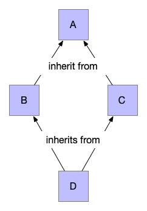

Polymorphism via dispatch2
==========================

Note: This section is expected to supercede the discussion on :doc:`objects`.

When writing our procedures/functions in a programming language, we deal with
different data structures and entities such as files, network sockets and
processes. For any given system, a number of such entities serves as its "API"
or "Application Programming Interface". If each of these entities were to be
transacted with using its own vocabulary, it will become very hard for
programmers to retain the vocabularies necessary to work with a practical
subset of these entity types in working memory so they act of programming is
both efficient and reliable. 

Thankfully, many of these entities can be worked with using a much smaller set
of "verbs" using which programmers typically chunk their thinking about them.
For example, both hash-tables and vectors in Racket offer the notion of
associating a value with a key. Only, in the case of hash-tables, the key can
be anything "hashable" whereas in the case of a vector, the key must be in the
range :math:`[0,N)`. However, the act of getting a value associated with a
particular key can simply be thought of across all such data structures using
the verb "get" and similarly the setting of a value against a particular key
can be thought of using the verb "set".

For an analogy, consider the Harry Potter world and Hermione Granger's timely
use of the spell "Alohamora" to open a lock. Suppose that in the wizarding
world, each kind of lock required a different spell to be learnt to open it --
"Alohamora Big One", "Alohamora 42", "Alohamora Locksmith & Sons Tiny 2021
edition" and so on -- wizards might give up pretty soon. But we have a hint
here -- that the word "Alohamora" suggests that the lock needs to be opened,
and the ones programming these locks can determine what to do when the lock
hears the spell "Alohamora", instead of making custom spells for it. This would
then obviously be preferrable for wizards (and students!) since they would then
need to remember far fewer spells overall to be effective in their world. 

Racket library functions kind of work as though they were in that complicated
world of spells. In Racket, though you'll find procedures named according to
such common vocabulary, each data structure carries its own set of procedures
to work with it. So vectors come with ``vector-ref`` and ``vector-set!`` and
``vector-length``, and similarly hash-tables have ``hash-ref``,
``hash-set!`` and ``hash-count``. If we were to invent another data
structure, say, ``treemap``, then we'll have to expose yet more procedures
named ``treemap-ref``, ``treemap-set!`` and ``treemap-length`` that will do
analogous things with tree maps. If we choose completely different vocabularies
-- say, ``treemap-search-and-retrieve``, ``treemap-find-and-replace`` and
``treemap-count-entries`` -- we'd place a huge cognitive burden on programmers
who'd want to adopt our new data structure since they cannot reuse their
vocabulary in the new context.

What if we could simply say ``ref``, ``set!`` and ``length`` and when we
introduce a new data structure, be able to declare how these verbs should work
with it at that point? That way, if we have a vector ``v``, we reference its
``k``-th element using ``(ref v k)`` and if we have a hashtable ``h`` and a key
``k``, we can get its associated value using ``(ref h k)`` as well, instead of
``(hash-ref h k)``. It is quite evident that the cognitive burden is lower for
such a unified concept of "``ref``-ing" a value. This "reuse of verbs" with
different objects is the essence of "polymorphism".

While doing this makes for concise code while writing, we also notice that when
reading code, ``(ref h k)`` tells us very little about ``h`` than "something we
can call ``ref`` on", whereas ``(hash-ref h k)`` is amply clear. This is part
of the reason for that design choice to be explicit in the Scheme/Racket
languages. The goal of a program is only partly to instruct machines (such as
"locks") but equally to communicate "how to" knowledge to other humans.

.. admonition:: **Terminology**

    Such a multi-purpose definition of a verb like ``ref`` and ``set!`` is
    referred to in programming languages as "polymorphism" and the verb is said
    to be "polymorphic" over a collection of types.

Generic procedures
------------------

So far we've defined procedures in Scheme/Racket using the ``define`` operator,
like this --

.. code:: racket

    (define (f x y) ...)

Once defined, the procedure ``f`` will remain bound to that body of code
forever .. until redefined entirely. What if, however, we wish to enable it to
be extensible with different code paths depending on what arguments are passed
to it. For simplicity, we'll assume that the arity of the function cannot be
changed, initially.

.. code:: racket

    (define (extend proc predicate extension)
        (lambda args
            (if (apply predicate args)
                (apply extension args)
                (apply proc args)))
    
    ; Example of extending ordinary artihmetic to symbolic arithmetic.
    (define sym+ 
        (extend +
                (lambda (x y)
                    (or (symbol? x) (symbol? y))
                (lambda (x y)
                    (list '+ x y)))))

    ; (plus 2 3) => 5
    ; (plus 2 'y) => '(+ 2 y)
    ; (plus 'x 3) => '(+ x 3)

However, instead of introducing a new symbol ``sym+`` for our extended
notion of addition, we can replace the earlier definition of ``+`` to 
mean what the new ``sym+`` means because ``sym+`` also deals with the
case of adding up ordinary numbers.

.. code:: racket

    (set! + sym+)

.. admonition:: **Exercise**

    When defining ``sym+``, we used the existing definition of ``+``. Now
    that we've changed what ``+`` means, do we now have a circular program?
    Explain whether you think "yes" or "no" is the answer to that question
    using your understanding of scoping rules of SMoL.

The predicate-extension pairs form the various branches of a ``cond``
expression that decides which of the extension procedures to call based on
properties met by the arguments --

.. code:: racket

    (cond
        [(apply predicate1 args) (apply extension1 args)]
        [(apply predicate2 args) (apply extension2 args)]
        ...)

Since the cond expression serves as a "post office" that "dispatches" the
arguments to the appropriate extension procedure, we refer to this approach in
the general sense as "dispatch mechanisms" and will study variants in this
chapter.

There are some incidental aspects of the above implementation of the extension
of a function that we won't concern ourselves about. For example, When we
extend with a new predicate and extension, the latest extension takes
precedence over the earlier installed ones. This raises a question -- "what if
we want it to be the other way around?" -- but there is little there of
interest to us at this point.

.. admonition:: **Restriction**

    For our purposes, we'll restrict our cases to where the predicates are all
    disjoint on any given list of arguments -- i.e. only one of the predicates
    evaluates to ``#t`` on a given list of arguments. This means we don't have
    to bother about the order in which we check the predicates.

So, the key idea behind organizing code using **dispatch** mechanisms is to
have a set of special case procedures associated with predicates on the generic
procedure's arguments which determine which special case is to be used.

One argument dispatch
---------------------

Let's take the simple case where all the predicates make their decisions based
only on the first argument. A classic example is "string representation". We'd
like to be able to view our values in some way and that calls for a textual
presentation of the value. 

.. code:: racket

    (define (as-string value)
        (if (string? value)
            value
            (error "Don't know how to treat value as a string")))

Now supposing we wish to extend this facility to integers. We will need a
special procedure for that --

.. code:: racket

    (define (int-as-string i)
        (cond
            [(= i 0) "0"]
            [(< i 0) (string-concat "-" (int-as-string (- i)))]
            [(> i 0) (positive-int-as-string i)]))
    (define (positive-int-as-string i)
        (if (= i 0)
            ""
            (string-concat (positive-int-as-string (div i 10)) (digit-as-string (remainder i 10)))))
    (define (digit-as-string d)
        (char->string (string-char-at "0123456789" d)))

Now we can augment our "as-string" generic procedure with this special case for
integers.

.. code:: racket

    (set! as-string (extend as-string
                            integer?
                            int-as-string))

Whenever we create a new data type in our program, we can augment our
``as-string`` generic procedure with a facility that works for our new type
when passed to it.

Note that we've now started associating the predicate for dispatch with a
"type" of value we're passing. Given data types ``A``, ``B``, ``C``, etc. in
our program, we'll then end up with specialization functions named
``A-as-string``, ``B-as-string``, ``C-as-string`` and so on which handle
``as-string`` cases for each of our types.

This is a little curious because we now associate the "ability to be expressed
as a string" with each of our data types for which we need that in our program.
So there are perhaps two equivalent ways of organizing our code here --

1. Maintain ``as-string`` in a module and add a new implementation to that
   module for every type we introduce within our program. This means every such
   type's definition will have to be imported into the module that builds up
   ``as-string``. If we continue along the lines of what we've been doing so
   far, we'll end up with this kind of an organization.

2. We can declare the ability to be presented as a string as a "property" of
   our data type, and declare the specialization wherever we declare our type.
   This then keeps all such behaviours together, which makes for ease of
   maintenance. However then, we need some background facility that will
   collect all such specifications for our various types and build up a single
   ``as-string`` that will dispatch over our data types.

A value as a "thing"
--------------------

If we articulate our extension approach as an ``as-string`` facility that's
attached to every value we create that's specialized to its purpose, we're
starting to think of our values as "things" ... more commonly known as
"objects" in programming.

In this perspective, an "object" has "properties" and "methods", which could be
seen as properties that are function valued which are then called supplying the
object as part of the list of arguments.

We'll explore this using the notion of a "property list" in our interpreter.

A "property list" associates a value as the property of a thing. Such a list
can be modeled using two accessor functions ``getprop`` and ``setprop!`` defined
as below -

.. code:: racket

    (define (make-proplist)
        (define *proplist* (box '()))

        (define (getprop thing property)
            (let loop [(tail (unbox *proplist*))]
                (if (null? tail)
                    (error "Thing doesn't have the specified property")
                    (let [(triple (first tail))]
                        ; [REF1] Why use `eq?` and `equal?` here?
                        (if (and (eq? (first triple) thing)
                                 (equal? (second triple) property))
                            (third triple)
                            (loop (rest tail)))))))

        (define (setprop! thing property value)
            (set-box! *proplist*
                      (cons (list thing property value)
                            (unbox *proplist*))))

        (values getprop setprop!))

    (define-values (getprop setprop!) (make-proplist))

As usual, we don't worry about efficiencies at this point, which shows
in how we simply add the property association as a new entry without
checking whether one already exists.

.. admonition:: **Question**

    [REF1] We used ``eq?`` to check for the "thing", and ``equal?`` for the
    "property". What are the consequences of this choice? What would other
    choices give us? (ex: ``equal?`` for "thing" and ``eq?`` for property, say)

With this mechanism at hand, we can now express the idea of dispatching
over the first argument using a common function ``invoke``.

.. code:: racket

    (define (invoke thing method-name . args)
        (let [(method (getprop thing method-name))]
            (if method
                (apply method (cons thing args))
                (error "Unknown method. [What do we do here?]"))))

Now, it's not usually the case that we want different methods to be attached to
different "things", but there is often a notion of "these things are of the
same kind and behave similarly with similar properties and methods". i.e. a set
of things might have common properties and methods and therefore it would be
redundant to have to specify the same collection of applicable methods for each
of them. Note that though methods (i.e. "behaviour") might be the same, the things
are usually distinguished by the values of their properties, their properties
are not necessarily the same.

Such a shared "table of methods" that defines the behaviour of a set of things
"of the same kind" is called a "class" in "object-oriented programming" languages.
In this case, our invoke takes a slightly different shape -

.. code:: racket

    (define (invoke thing method-name . args)
        (let [(tclass (getprop thing 'class))]
            (if tclass
                (invoke-by-class tclass thing method-name args)
                (error "All things must be associated with a class in total OOP systems"))))

    (define (invoke-by-class tclass thing method-name args)
        (let [(method (getprop tclass method-name))]
            (if method
                (apply method (cons tclass (cons thing (cons method-name args))))
                (error "What do we do here when a method is absent in a class?"))))

One further thing to notice is that so far, our ``getprop`` will actually error
out if the given property was not found. So we really can't branch like ``(if
tclass ...)``. To support that in a general way, let's augment ``getprop`` with
a delegate procedure that will be called for the "property not found" case.

.. code:: racket

    (define (make-proplist)
        (define *proplist* (box '()))

        (define (getprop thing property delegate)
            (let loop [(tail (unbox *proplist*))]
                (if (null? tail)
                    (delegate thing property)
                    (let [(triple (first tail))]
                        (if (and (eq? (first triple) thing)
                                 (equal? (second triple) property))
                            (third triple)
                            (loop (rest tail)))))))

        (define (setprop! thing property value)
            (set-box! *proplist*
                      (cons (list thing property value)
                            (unbox *proplist*))))

        (values getprop setprop!))

Now we can write our ``invoke`` procedure like this --

.. code:: racket

    (define (invoke thing method-name . args)
        (let [(tclass (getprop thing 'class
                               (lambda (thing property)
                                    (error "All things must be associated with a class"))))]
            (invoke-by-class tclass thing method-name args)))

    (define (invoke-by-class tclass thing method-name args)
        (let [(method (getprop tclass method-name
                               (lambda (thing property)
                                    (error "What to do here when a method is absent in a class?"))))]
            (apply method (cons tclass (cons thing (cons method-name args))))))

This way of approaching dispatch via an explicit "dispatch table" necessitates
that whenever an object is created, a call to ``setprop!`` is made to set its
class. In "pure OOP" systems such as Smalltalk, Self and Ruby, the task of
creating an instance of a class (i.e. an "object") falls on the class. So a
"class" is thought of as a machine for making objects with specific behaviours.

.. note:: In OOP languages, a "class" may be thought of as a machine for
   making objects with specific behaviours.

We have a choice for when a method is not present in a class. For one thing, we
can ask another class for the method, this other class being associated with the
original class (``tclass``). If we do this, then this other class is expected to
support a set of methods common to a number of classes of which ``tclass`` is one,
and so is thought of as a "super class". Our invoke then becomes --

.. code:: racket

    (define (invoke-by-class tclass thing method-name args)
        (let* [(end-of-class-hierarchy-error
                   (lambda (tclass super-class)
                       (error "End of class hierarchy. Method not found.")))
               (delegate (lambda (tclass method-name)
                             (let [(super-class (getprop tclass 'super-class
                                                         end-of-class-hierarchy-error))]
                                    (invoke-by-class super-class thing method-name args))))
               (method (getprop tclass method-name delegate))]
            (apply method (cons tclass (cons thing args)))))

And tada! We now have "inheritance" in our object system. 

Notice that when we invoke the method procedure, we pass the ``tclass`` in
addition to the ``thing`` argument. This is necessary in this approach because
the method may decide that it needs to delegate it to the method implemented
for the super-class, in which case it needs to know which class it is
associated with so it can ask for its super-class. In OOP languages, this is
typically found as a call to ``super``.

To implement "multiple inheritance", we will need to change the lookup of a
super class into a lookup for "super classes" - i.e. a list of classes.

.. code:: racket
   
    (define (invoke-by-class/mi tclass thing method-name args handle-method-not-found)
        (let [(method (getprop tclass method-name
                (lambda (tclass method-name)
                    (let loop [(supers (getprop tclass 'super-classes))]
                        (if (null? supers)
                            (handle-method-not-found thing method-name args)
                            (invoke-by-class/mi (first supers) thing method-name 
                                (lambda (thing method-name args)
                                    (loop (rest supers)))))))))]
            (apply method (cons tclass (cons thing args)))))
                                

So when we have such "multiple inheritance", we need to make an explicit choice
about how to resolve methods using the class hierarchy -- i.e. **how** we do
method resolution has a bearing on **what our program means**. This is usually
a sign of a deficient language feature. 

Note that in this scenario, it is possible that we may scan a particular class
more than once for a method definition, because that class may be a super for a
few different classes, all of which our ``thing``'s class happens to inherit
from. This situation where the intent of the programmer is not entirely clear
without more information, is called the "diamond problem". Since commercially
important languages like C++ feature multiple inheritance, we discuss that a bit
more below.

Multiple inheritance
--------------------

When we have an inheritance hierarchy, we use that for "method resolution" --
i.e. to determine which particular implementation to use when the user mentions
a method invocation.

"Multiple inheritance" refers to a value (or a new type) inheriting the
functionality of a number of other types by declaring them as "parents".
Multiple inheritance can lead to certain kinds of problems. For example, if two
of the "inherited" types prescribe different behaviours for the same
method/message, it is unclear which behaviour the type or value must inherit.

Programming languages try to "solve" this problem through some predictable
mechanism that, despite the ambiguity continuing to exist in principle, makes
it easy to determine which behaviour manifests by inspecting the code. For
example, C++ solves it by mandating that the declaration order of the classes
featuring in the inheritance list determines the priority for selection of a
method implementation -- i.e. if A and B are both parent classes declared in
that order and both specify implementations for method M, then if the
declaration order is ``A, B``, then A's implementation takes precedence over
B's and if the order is ``B, A``, then B's implementation takes precedence over
A's. 

While such a resolution mechanism appears to address the issue, it is still not
clear from the program design perspective what actually should happen in some
cases and for that reason it is better to avoid this kind of a situation
altogether, as the confusion far outweighs benefits.. For example, if ``A`` is
a class that ``B`` and ``C`` inherit from and both override behaviour of method
``M``, and subsequently ``D`` inherits from both ``B, C``, both the behaviours
of ``B`` and ``C`` for method ``M`` seem appropriate as the implementation for
``D``. So which one to choose? Again, even if this is resolved by the
"declaration sequence = priority" approach, the burden has merely shifted to
the programmer to decide which of the two orders to choose. Due to the nature
of the inheritance pattern, this is referred to as "the diamond problem" in OOP
literature.

   When two "base classes" a.k.a. "parent classes" of a class themselves
   share the same base class, we have a "diamond problem" at hand.

Traits: classes as types
------------------------

A thing having its behaviour described by a class has the advantage that we can
query the thing to see whether a particular method can act on it. The class, in
this role, serves the abstract purpose of certifying the thing to be of a
certain "type", if the class provides no concrete implementation of methods and
only serves to make such a declaration. Such a class is called "an abstract
base class" (C++) or, in some languages, a "trait" (Rust) or a "protocol"
(Objective-C) or "interface" (Java). Any derived classes must then provide
concrete implementation of these methods to conform to the trait.

.. admonition:: **Ponder this**

    How does this approach solve the diamond problem discussed in the previous
    section?

Designing a program using such "interface" classes with only one level of concrete
classes inheriting from such interface classes seems restrictive on the surface,
but is in practice a very useful and extensible design approach. What we're
talking about here is a design in which every object is an instance of exactly
one concrete class that may "implement" any number of "interfaces" directly or
indirectly.

There can be many implementations of an interface and to use an object, the
programmer only needs to know the specification of the interface and its
methods and little to nothing about the implementation details. This
interface-implementation is made explicit in the Java language where an
"interface" cannot syntactically declare any concrete method behaviours [#intf]_ whereas
a "class" can "implement" an interface and declare implementations. In
Objective-C/C++ (used in iOS programming) the concept of an interface is
referred to as a "protocol" since the language takes the "method invocation is
a form of message passing" view.

.. [#intf] Recent Java versions break this in limited ways - where a default
   implementation can be provided that defines a behaviour in terms of other
   methods only ... since no information about properties (a.k.a. "member
   variables") is available at the point an interface is being defined.

For example, a "Serializable" interface may declare the following methods (shown
in the syntaxes of a few different programming languages) [^ --

.. code:: Java

    // Java
    interface Serializable {
        bytes serialize();
        // Here Stream would also be an interface spec.
        void serializeToStream(Stream s);
    }

.. code:: cpp

    // C++
    class Serializable {
        virtual unsigned char * serialize() = 0;
        // Here Stream would also be an interface class.
        virtual void serializeToStream(Stream *s) = 0;
    }

.. code:: objc

    /* Objective-C/C++ */
    @protocol Serializable
    - (NSData*)serialize;
    /* Here Stream is a protocol that the passed object is expected to meet. */
    - (void)serializeToStream: (id<Stream>)s;
    @end

.. code:: rust

    trait ReadableStream {
        fn read_byte(&self) -> uint8;
    }

    trait WritableStream {
        fn write_byte(&self, b::uint8);
    }

    trait Serializable {
        type CT;
        fn serialize(&self) -> Vec<uint8>;
        fn serializeToStream(&self, WritableStream:&Self::CT);
    }

In languages like Rust and Julia which are not OOP in the traditional sense but
have a notion of a protocol or interface, this idea of an "abstract base class"
is known as a "type trait" or simply "trait". A trait, therefore, is a
specification of all the methods that a concrete type that declares itself to
implement the trait must provide implementations for to qualify as an
implementation of the trait.

Such "abstract base classes" or "type traits" may themselves declare as
inheriting from other traits and that "trait inheritance hierarchy" can go
arbitrarily deep. However, since they're all declarations and there can be only
one concrete implementation for the collection of methods indicated through
such an inheritance mechanism, there is no "diamond problem" any more. But yet
again, if this structure turns up in a model of a domain, the responsibility
for deciding what must happen when a particular method is invoked continues to
fall on the programmer of that final implementation.

"Pure" OOP
----------

Languages such as Smalltalk, Self and Rust call themselves "pure
object-oriented languages", by which they mean that every value is an object
and anything that happens is dictated by a method invocation. This corresponds
roughly to "everything is a lambda" in its universality, but at some level the
system provides some built-in facilities without which we won't be able to get
anything valuable done at all.

The "anything that happens has to be by method invocation" restriction is not
as trivial as it might seem. For example, here are some --

1. How do you do arithmetic? You invoke the "+" method of a "number object"
   supplying another number object as an argument.
2. How to create an object? You have to invoke a "new" method on its class.
3. How do you create a class? You have to invoke the "new" method on its "metaclass".
4. How do you add a method to a class? You have to invoke the "addMethod:" method on its metaclass.
5. How do you create a metaclass? You have to invoke the "new" method on the `Metaclass` metaclass.

... and so on. Somewhere down the line, the snake has to eat its own tail and
things other than method invocation must begin happening in a practical system.
So the "purity" usually refers to everything that's accessible to the
language's user. Given that, systems such as Smalltalk provide very deep
customizability where you can, for example, change aspects of the VM within
Smalltalk itself since its VM and compiler are themselves written is Smalltalk
and are entirely accessible within the language.

For the record, C++ and Java are not "Pure OOP" languages since classes
and objects have different existences in these languages.

Multiple argument dispatch
--------------------------

So far, we looked at dispatching over the first argument of a procedure, which led
us to object oriented languages. What if we can dispatch over multiple argument types?

