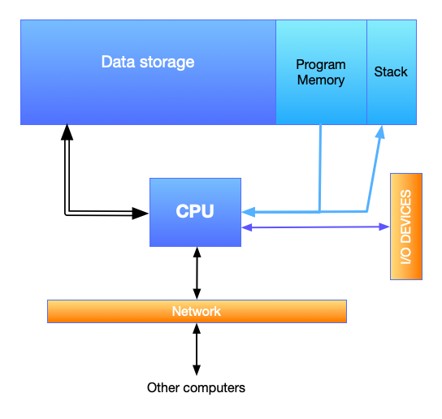

Mutations
=========

Much in the history of programming languages has been concerned with what we'd
call "imperative" style of programming. This involves thinking of a program as
"performing a sequence of steps" and less as "computing a particular value from
some set of input values".

While the notion of "sequencing" appears to dominate that description, we need to
look deeper to see why such a sequencing even deserves a mention there. 

Let's look at a typical computer architecture --

         program memory, I/O devices and the network.

   Core components of a modern "computer".

Such a computer features a CPU at the heart, which pull a sequence of instructions
from the "program memory" and "executes" them one by one. Some of these instructions
may ask the CPU to fetch some data from the data storage, or to write data into
some locations in the data storage, or to read/write data to the network or chosen
I/O devices.

So the journey of a program is close enough to how we've been expressing the
:rkt:`stack-machine` in earlier sections, except we didn't have explicit notions
of I/O devices or network. The :rkt:`stack-machine` function serves as our "CPU"
model, the list of instructions or "program" serves as our model of the "program
memory" and the stack and bindings are part of the data storage.

In the "expression evaluator" formulation though, we formulated our language
there as though evaluating an expression has no other consequences than
computing the result value. The "bindings" argument (i.e. the "environment")
was incidental to this calculation. This corresponds to the stack picture as
well, if we throw away the bindings as a "result" and only consider what's on
the stack as the intended result.

If you think of data memory as addressed using whole numbers, then both our
languages don't quite have the equivalent of "read an integer from memory
location 132357" and "write the integer value 42 to memory location 238576".
With these kinds of operations, it is clear that the order of the operations
critically affects the computation performed. If you write to a memory location
and read it back, you'll get the value you wrote, but if you read it and then
write a different value back, the value you read in could be something else.

Therefore, the need for sequencing arises (at least in this case) as a side
effect of a model of computation where we're reading from and writing to
addressable memory locations that're **mutable**.

The Racket "box"
----------------

Racket provides an entity called a "box" that is akin to a one-element mutable
vector. A box is either empty or has something in it and you can change the
contents of the box.

.. code-block:: racket

    (define b (box 24))
    (display (unbox b))  ; Prints 24
    (set-box! b 42)
    (display (unbox b))  ; Prints 42

We can treat such a mutable box as a reference to a storage location in data
memory of our computer. The symbol :rkt:`b` in the above example is bound to
this "memory location". So the :rkt:`unbox` procedure can fetch the contents of
this memory location and the :rkt:`set-box!` procedure can modify its contents.
As seen in the example above, between the first :rkt:`display` call and the
next, something has happened to the box. It is this "something" that we intend
to model in our interpreter. We'll consider both models -- the expression
evaluator we've called :rkt:`interp` as well as the :rkt:`stack-machine`.

Working with "boxes" is done via three functions -

1. :rkt:`(box <val>)` which creates a mutable box and returns a reference to
   the box.

2. :rkt:`(unbox b)` which looks into the given box and produces the value it
   contains.

3. :rkt:`(set-box! b <newval>)` which replaces the contents of the given box
   with the new value. The result value of :rkt:`set-box!` is of no consequence
   and can be anything we deem convenient to us. We might consider it
   convenient for it to produce the box itself, for example. Racket makes this
   irrelevance explicit by declaring :rkt:`set-box!` expressions to result in
   :rkt:`void`.

Sequencing
----------

The main aspect of using boxes that we need to pay attention to is that
with operations like :rkt:`set-box!`, we now have to pay attention to the order
in which expressions are evaluated, even at the same "level" in our expression
language. Racket has a construct that makes this sequencing explicit --

.. code-block:: racket

    (begin
        <expr1>
        <expr2>
        ...
        <exprN>)

The result of such a :rkt:`begin` expression is that of the last :rkt:`<exprN>`
in the sequence. :rkt:`begin` guarantees that the expressions will be evaluated
in the given order, so we can make assumptions about any mutating operations
we've used there. 

So if we're to add mutating operations to our language, we will need to add a
notion of state (such as a mutable box) as well as implement a notion of
sequencing computations.

Sequencing in the stack machine
-------------------------------

We've already seen sequencing of operations happening in our
:rkt:`stack-machine` -- whose "program" consists of a sequence of instructions,
each of which take in a "state" and produce a new state. In our case, "state"
includes a "stack" as well as a "list of bindings" structure.

The mechanism of passing this state from one instruction to another is
worth revisiting since that is the same mechanism we'll need to bring about
mutations in our :rkt:`PicLang`.

.. code-block:: racket

    (define (stack-machine program state)
        (if (empty? program)
            state
            ;      v--- the next state                         v------- the current state
            (let ([state2 (process-instruction (first program) state)])
               ;                                  | Use the next state for the rest
               ;                             v----/ of the program.
               (stack-machine (rest program) state2))))

We see how what we're calling "state" undergoes changes as each instruction is
performed, resulting in the final state. The sequence of instruction evaluation
very much matters with our stack machine, unlike the expression evaluation
based interpreter we wrote, which relies on Racket's own stack mechanism.

So let's now look at how to implement such sequencing in our PicLang.

Terms for boxes
---------------

Corresponding to the functions that Racket provides for boxes, we'll need a
few new terms --

.. code-block:: racket

    (struct (e) Box ([expr : (Expr e)]))
                            ; Makes a new box whose value is the result
                            ; of evluating the given expression.

    (struct (e) Unbox ([expr : (Expr e)])
                            ; expr is expected to be a box-producing expression.

    (struct (e) SetBox ([boxexpr : (Expr e)]
                        [valexpr : (Expr e)]))
                                      ; For modifying the contents of the box
                                      ; to hold a new value. The first field
                                      ; is expected to be a identifier bound
                                      ; to a box value in the current environment.

We also saw that to implement mutating operations, we will need a notion of
"sequencing" in our language. We'll add a term for that too, which corresponds
to the Racket :rkt:`begin` expression.

.. code-block:: racket

    (struct (e) Seq ([e1 : (Expr e)]
                     [e2 : (Expr e)])
           ; We'll limit ourselves to two expressions
           ; as we can compose more using a form like
           ; (Seq expr1 (Seq expr2 (Seq expr3 expr4)))

Now let's look at how our interpreter will handle these terms. The result of
our interpreter will now need to be a pair of values - the actual value
and the new state of the "storage" that is woven through the sequencing
operations.

A model of mutable memory
-------------------------

We'll need a model for working with memory. For our purpose, a "memory" needs a
pool of available "slots" that refer to memory locations and procedures to
read/write these slots. We'll use simple integers to identify slots. These
can also be called "pointers" and in systems programming languages like C and Rust,
pointers to memory locations are essentially positive integers.

.. code-block:: racket

   (define-type Pointer Positive-Integer)
   (struct Memory ([slots : (Listof Pointer)]
                   [values : (Env Pointer Val)])
         #:transparent)

   (define (initial-mem) (Memory (list 1 2 3 4 5 6 7 8) empty-env))

   (: malloc (-> Memory (Pair Pointer Memory)))
   (define (malloc mem)
      (let ([slots (Memory-slots mem)])
         (if (empty? slots)
             (error "Out of memory")
             (cons (first slots)
                   (Memory (rest slots) (Memory-values mem))))))

   (: mfree (-> Memory Pointer Memory))
   (define (mfree mem slot)
      (if (member slot (Memory-slots mem))
          (error "Double free of slot")
          (Memory (cons slot (Memory-slots mem))
                  (Memory-values mem))))

   (: mread (-> Memory Pointer Val))
   (define (mread mem slot)
      (lookup (Memory-values mem) slot))

   (: mwrite (-> Memory Pointer Val Memory))
   (define (mwrite mem slot val)
      (Memory (Memory-slots mem)
              (extend (Memory-values mem)
                      slot
                      val)))

The interpreter with mutations
------------------------------

We'll also need a new possible value for our interpreter .. one we expect
to get when we evaluate a :rkt:`Box` term. We'll call this :rkt:`PtrV`
and have the structure store a "reference" that points into the storage.

.. code-block:: racket

    (struct Res ([mem : Memory] [val : Val]) #:transparent)
    (struct PtrV ([p : Pointer]) #:transparent)

    (define-type Val (U PtrV ...others...))

Our interpreter now should evaluate the computations in the correct
sequence and "thread" the memory through these computations in the
correct order.

.. code-block:: racket

   (: interp (-> (Env Symbol Val) Memory ExprC Res))
   (define (interp env mem expr)
      (match expr
         ; ...
         ; ... TASK: rewrite the ordinary expressions to return a Result structure.
         ; ...
         [(Box valexpr)
          (let* ([r (interp env mem valexpr)]
                 [p (malloc (Res-mem r))]
                 [m (mwrite (cdr p) (car p) (Res-val r))])
            (Res m (PtrV (car p))))]
         [(Unbox expr)
          (let ([r (interp env mem expr)])
            (Res (Res-mem r)
                 (mread (Res-mem r) (ptrv (Res-val r)))))]
         [(SetBox boxexpr valexpr)
          (let* ([b (interp env mem boxexpr)]
                 [v (interp env (Res-mem b) valexpr)]
                 [m (mwrite (Res-mem v) (ptrv (Res-val b)) (Res-val v))])
            (Res m (Res-val v)))]
         [(Seq e1 e2)
          (let* ([v1 (interp env mem e1)]
                 [v2 (interp env (Res-mem v1) e2)])
            v2)]
         ; ...
         ; ... TASK: Apply implementation also needs to change. Rewrite it.
         ; ...
         ))

Now, the pattern of "threading the memory through the computations" is not
quite apparent in the code above. We can make it clearer using appropriate
named identifiers and the ``match-let`` and ``match-let*`` forms, which desugar to
``match`` and ``let`` as shown below --

.. code-block:: racket

   (match-let ([<pattern1> <expr1>]
               [<pattern2> <expr2>])
      <expr>)
   ; => desugars to =>
   (match (list <expr1> <expr2>)
      [(list <pattern1> <pattern2>) <expr>])

   (match-let* ([<pattern1> <expr1>]
                [<pattern2> <expr2>])
         <expr>)
   ; => desugars to =>
   (match <expr1>
      [<pattern1>
       (match <expr2>
          [<pattern2> <expr>])])

Using these, we can rewrite the "mutation" parts of the interperter like this -

.. code-racket:: racket

    (: interp (-> (Env Symbol Val) Memory ExprC Res))
    (define (interp env mem expr)
        (match expr
            ; ...
            ; ... TASK: rewrite the ordinary expressions to return a Result structure.
            ; ...
            [(Box valexpr)
             (match-let* ([(Res m v) (interp env mem valexpr)]
                          [(cons ptr m2) (malloc m)]
                          [m3 (mwrite m2 ptr v)])
               (Res m3 (PtrV ptr)))]
            [(Unbox expr)
             (match-let ([(Res m v) (interp env mem expr)])
                (Res m (mread m (ptrv v))))]
            [(SetBox boxexpr valexpr)
             (match-let* ([(Res mb vb) (interp env mem boxexpr)]
                          [(Res mv vv) (interp env mb valexpr)])
               (Res (mwrite mv (ptrv vb) vv) vv))]
            [(Seq e1 e2)
             (match-let* ([(Res m1 v1) (interp env mem e1)]
                          [(Res m2 v2) (interp env m1 e2)])
               (Res m2 v2))]
            ; ...
            ; ... TASK: Apply implementation also needs to change. Rewrite it.
            ; ...
            ))

Super powers
------------

With any such feature addition to a language, it is always necessary to ask
what kinds of, what we've been calling, "super powers" does it give us. So
what new super power did we gain by having mutable storage in our language?

.. note:: Think about this for a bit and see if you can come up with your
   own answers before reading on.

When introducing this feature, we also had to ensure that our other existing
language terms work sensibly with this new one. For example, in implementing
:rkt:`(ApplyC funexpr valexpr)`, we needed to sequence the evaluation of 
the :rkt:`funexpr` term and the :rkt:`valexpr` term, because either term could
contain subexpressions that change the state of the storage. It is as though
:rkt:`ApplyC` is to behave like :rkt:`(ApplyC funexpr (SeqC funexpr valexpr))`
in our older implementation of :rkt:`ApplyC` which did not propagate the storage
changes to the evaluation of the :rkt:`valexpr` part. 

Super powers we gain from a new language feature are usually from the
consequences of ensuring sensible interoperability of the new feature with the
existing features.

In this case, we've gained the ability to have our functions produce different
values each time they're applied. Here's how you'd express this possibility
in Racket code --

.. code-block:: racket

    (define (count-up start) 
        (let ([b (box start)])
            (λ ()
                (let ([v (unbox b)])
                    (set-box! b (+ v 1))
                    v))))

    (define nats (count-up 0))
    (writeln (nats)) ; prints 0
    (writeln (nats)) ; prints 1
    (writeln (nats)) ; prints 2
    (writeln (nats)) ; prints 3

 
.. admonition:: **Exercise**

    Think of a case in PicLang where this could be useful. Code it up,
    make some interesting pictures and share on the discussion board.

When we dealt with recursion using lambda calculus, we worked through
the Y and :math:`\Theta` combinators that can generate the recursion
without having support for recursive mention of functions at definition
time. If we have mutation at hand, we can do the following "trick",
even without a recursion-capable :rkt:`define`.

.. code-block:: racket

    (define factorial
        (let ([fn (box #f)])
            (set-box! fn 
                      (λ (n)
                         (if (equal? n 0)
                             1
                             (* n ((unbox fn) (- n 1))))))
            (unbox fn)))

No combinators! The λ expression closes over the box value bound to :rkt:`fn`.

.. note:: The :rkt:`letrec` form in Racket/Scheme does this kind of a trick,
   but (roughly speaking) by using Scheme identifiers as variables.

State machines
--------------

.. index:: State machines

"Function returning different values each time it is called" is a kind of silly
way of stating the "super power" we've got. This is much bigger than what it
looks like -- which perhaps deserves a response like "ok, so what?".

To see why this is much bigger, think of what we can do with something even as
simple as an counter like above. Imagine a general function of this form --

.. code-block:: racket

    (define machine (lambda (n arg)
                        (match n
                            [0 (list expr0 <next-n>)]
                            [1 (list expr1 <next-n>)]
                            [2 (list expr2 <next-n>)]
                            ;...
                            )))

The way we can use this function is to start with passing :rkt:`n=0`
and get the result, then take the :rkt:`next-n` part and call the function
again with that :rkt:`next-n` value and repeat this process.

.. note:: You've done this before earlier in this section. Twice! Can you
   recognize this pattern?

.. admonition:: **Exercise**

    Can you write such a "machine" function that produces the cumulative
    sum of the sequence of numbers passed in as :rkt:`arg`? That is,
    if you repeatedly call the machine function (passing the :rkt:`<next-n>`
    correctly, and pass in :rkt:`arg` values of :rkt:`1,5,3,8` one by one,
    the result part of the returned values will be :rkt:`1,6,9,17`.

However, it is kind of cumbersome to pass the :rkt:`next-n` values like 
that. Because we now have sequencing ability in our language, we can
express it as a function that will keep changing what it calculates
every time it is called without us doing any of that "threading" of
:rkt:`next-n` values.

.. code-block:: racket

    (define machine (let ([b (box 0)])
                        (lambda (arg)
                            (match (unbox b)
                                [0 (let ([v0 expr0]) (set-box! b <next-n>) v0)]
                                [1 (let ([v1 expr1]) (set-box! b <next-n>) v1)]
                                [2 (let ([v2 expr2]) (set-box! b <next-n>) v2)]
                                ; ...
                                ))))

Now, the machine will keep jumping between these numbered "states" every time
we call it with some argument. We call such functions "state machines" ...
which is closely related to the architecture of the :rkt:`stack-machine` we've
worked with so far. Explicit state machines are a great way to organize certain
kinds of computations. At some level, every program is trivially a state machine 
too.

.. note:: Do you see why that is the case?

We won't get into the details of state machines right now as we'll have plenty
of opportunity soon enough. However, here is an example that might be relatable --
when you're "parsing" a stream of symbols (i.e. text), a parser typically tracks
what it sees by maintaining a history of states and deciding, upon encountering
each symbol, what the next state should be. For example, consider a parser for
decimal numbers of the form "123.4", "0.4446" etc. We could describe a parser
for such numbers in terms of 6 states as follows --

``[START-DECIMAL-NUMBER]`` 
    If the next character is not a decimal digit, we jump to state
    ``[NOT-A-DECIMAL-NUMBER]``. If the next character is a decimal digit, we
    add two numbers :math:`N` and :math:`D` to our state and initialize them
    both to :math:`0`, then move to state ``[DIGIT-BEFORE-DECIMAL-PT]``.

``[DIGIT-BEFORE-DECIMAL-PT]``  
    If the next character is a decimal digit
    :math:`d`, we update :math:`N \leftarrow 10N+\text{value}(d)` and move to
    ``[DIGIT-BEFORE-DECIMAL-PT]``. If the next character is a period instead,
    we jump to ``[DECIMAL-PT]``. On encountering any other character, we jump
    to ``[DECIMAL-NUMBER-COMPLETE]`` after returning the character to the stream.

``[DECIMAL-PT]``
    We set :math:`D \leftarrow 0` and move to ``[DIGIT-AFTER-DECIMAL-PT]``.

``[DIGIT-AFTER-DECIMAL-PT]``
    If the next character is a decimal digit
    :math:`d`, we update :math:`D \leftarrow D+1` and update 
    :math:`N \leftarrow N+\text{value}(d)\times 10^{-D}`, and move to state
    ``[DIGIT-AFTER-DECIMAL-PT]``. If the next character is anything other than a
    decimal digit, we return the character to the stream and move to the
    ``[DECIMAL-NUMBER-COMPLETE]`` state.

``[DECIMAL-NUMBER-COMPLETE]`` 
    We declare the result of the parse to be the
    number :math:`N`. If our task is done, we can keep returning to this same
    state. Otherwise we can move to another state as required.

``[NOT-A-DECIMAL-NUMBER]``
    This is a terminal state since we can't do anything else at this point.
    
So we could write a state machine with these states numbered 0,1,2,3,4,5 which
can handle parsing of such decimal numbers given one character at a time.

