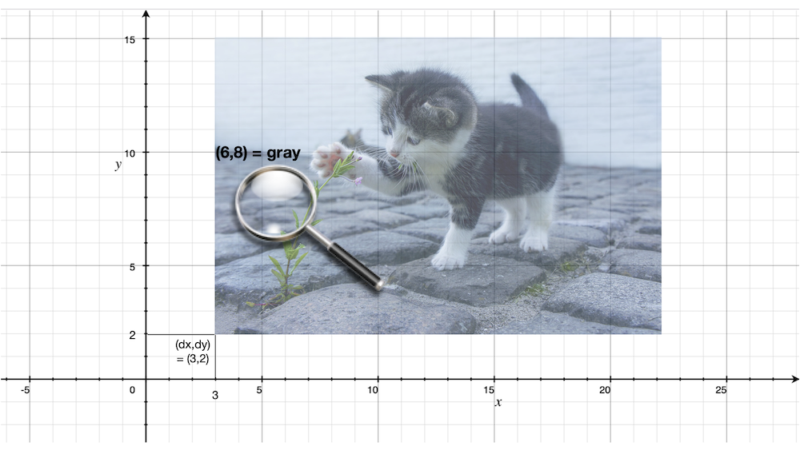

A language for pictures
=======================

The original PLAI course used arithmetic to introduce some ideas. On polling,
students seemed more inclined towards picking something more interesting like
picture composition. So we'll take that track. I hasten to add that there'll be
additional work involved and less scaffolding, though you'll be well rewarded
by exposure to the process of building an understanding of a domain through
language construction, from ground up, in addition to working through
programming language principles. I will try to retain the spirit of the PLAI
course through this exercise so that you can follow the concepts via the
arithmetic route and still be able to relate to what we're doing here.

.. note:: We're not going to be building an "image processing toolkit". What
   we're interested in is making (hopefully) pretty pictures. The former is
   about processing images typically captured by cameras or scanners as a 2D
   array of "pixels". The latter is about composing pictures, including but not
   limited to the "2D pixel array" variety.

Growing a language
------------------

We're about to launch off a precipice in our efforts to figure out a language
for composing pictures. When we set out on such a task in any domain, there are
a few things we need to do to build up our understanding of the domain first.
For what are you going to build a language for if you don't understand it in the
first place? We'll need to --

1. Get a sense of the "vocabulary" we want for working with pictures.

2. Get a sense of how we wish to be able to generate pictures, transform them
   or combine more than one to form a new picture.

3. Figure out the essence of picture composition -- i.e. a minimal "core"
   language in which we we can express the ideas we're interested in. Translate
   more specific ideas into this core language.

Note that we do not need to get all of this right at the first shot. We can
take some reasonable steps and improve what we have at hand when we recognize
the opportunity. To do that effectively, we'll need to keep our eye on the
mentioned "minimal core" as we go along.

.. admonition:: **Credits**

    This section is named in honour of an amazing talk of the same title by Guy
    Steele, the co-creator of Scheme - `Growing a language, by Guy Steele
    <gal_>`_ (youtube link) given in 1998. It is a fantastic talk and a great
    performance & delivery, that I much recommend students watch and
    contemplate on. The beginning of the talk may unfortunately put off some as
    it appears sexist, but Guy is aware of it and explains himself a little
    into the talk. So do press on.

.. _gal: https://www.youtube.com/watch?v=_ahvzDzKdB0

A plausible vocabulary
----------------------

Let's consider 3 categories of images that students gave examples of --

1. "Primitives" such as circles, rectangles, squares and triangles. We include
   images loaded from files in this category since they do not depend on the
   content of other images. We'll use the `Plain PPM`_ file format since it is
   a simple text-based format that's easy to parse and write. [#ppm]_

2. Transformations -- including colour transformations and spatial transformations
   like translation, rotation, scaling and mirroring. These take one image and
   modify their appearance to produce another "transformed" image.

3. Combinations -- including placing one image on top of another, "blending"
   two images and such.

The above is already giving us a plausible vocabulary for talking about
pictures to begin with, even though we don't yet know what exactly a "picture"
is. We can represent these ideas using s-expressions like below --

.. [#ppm] You've already been given instructions to write functions to read and
   write this format.

Primitives

    .. code-block:: racket

        (circle <radius>)
        (square <width>)
        (rectangle <width> <height>)
        (image-from-file <filename.ppm>)

Transformations

    .. code-block:: racket

        (invert-colour )
        (gray-scale )
        (translate <dx> <dy> )
        (rotate <angle> )
        (scale <xscale> <yscale> )

Combinations

    .. code-block:: racket

        (place-on-top <img1> <img2>)
        (mask <mask-img> )
        (blend <img1> <img2>)

What some of them do might be obvious while others may not be so obvious. This
means we'll now need to commit to some "representation" of pictures so we can
figure out these details.

In particular we need to understand "colour" first. 

What is "colour"?
-----------------

I'm not talking about a general perceptual understanding of colour here, though
that is a fascinating topic worthy of its own course. For our purposes, we'll
satisfy ourselves with determing colour in terms of three well known colour
components -- red, green and blue. We'll represent a mixture of these colour
components by giving three real numbers in the range :math:`[0.0,1.0]` that
given the proportions in which to mix them to get a colour. We'll also use an
"alpha" value in the range :math:`[0.0,1.0]` to indicate the opacity of a
colour. This will be useful when we blend two colours. In typical image files
as well as displays, these proportions are not usually represented as floating
point numbers, for efficiency. They're given as integers in the range
:math:`[0,255]`, with the assumption that we'll scale them to :math:`255` (or
:math:`256` which is close enough) to get the proportions.

We can represent such a colour easily in Racket using --

.. code-block:: racket

    ; The four colour components are floating point numbers
    ; in the range [0.0,1.0]
    (struct colour (a r g b))

Once defined in this way, we can make a colour using :rkt:`(colour a r g b)`
and get the various components of a colour :rkt:`c` using :rkt:`(colour-r c)`,
:rkt:`(colour-b c)` etc.

.. _Plain PPM: http://netpbm.sourceforge.net/doc/ppm.html#plainppm

So, what is an "image" or "picture"?
------------------------------------

When we look at a picture, what are we actually looking at? If we take up a
magnifying glass in our hands, we can pore over the details of the picture by
moving it over the region of interest to us. That is, we can consider for the
moment that a picture is a mapping from a pair of spatial coordinates to a
colour.

In the previous session on "lambda", we represented whole numbers using
functions to build up confidence that functions are powerful enough to capture
all of computation. We should therefore expect that they will suffice for
images too.  Below, we'll use Haskell type notation which you're familiar with
to capture the idea of the types of things we're dealing with.

.. code-block:: haskell
    
    type Coords = (Float, Float)
    type Image = Coords -> Colour

   An image can be thought of as a mapping from a pair of spatial coordinates :math:`(x,y)`
   to a colour value. (Credits: catpic_ and magglass_) 
   
.. _catpic: https://commons.wikimedia.org/wiki/File:A_curious_kitten_(Pixabay).jpg
.. _magglass: https://commons.wikimedia.org/wiki/File:Hand_glass.png

Is it too abstract to think of a picture like that? Since we haven't yet figured out
how exactly we want to treat pictures, this is a reasonable starting point since we
can produce a "raster image" (a 2D array of pixels) by calling the "image function"
for various values of :math:`x` and :math:`y` and recording the colour produced. 

Let's now consider some simple pictures --

.. code-block:: racket

    ; disc :: Float -> Image
    ;
    ; Produces a white disc against a black background.
    ; The background is totally transparent everywhere outside
    ; the radius of the disc.
    (define (disc radius)
        (λ (x y)
           (let ([r (sqrt (+ (* x x) (* y y)))])
             (if (< r radius)
                 (colour 1.0 1.0 1.0 1.0)
                 (colour 0.0 0.0 0.0 0.0)))))

    ; square :: Float -> Image
    ;
    ; (square 1.0) will make a unit square centered around
    ; the origin. Similar colour structure to the disc.
    (define (square width)
        (λ (x y)
           (let ([half (* 0.5 width)])
               (if (and (> x (- half)) (< x half)
                        (> y (- half)) (< y half))
                   (colour 1.0 1.0 1.0 1.0)
                   (colour 0.0 0.0 0.0 0.0)))))

We can also write functions that transform these primitives spatially and in colour --

.. code-block:: racket

    ; translate :: Float -> Float -> Image -> Image
    ;
    ; Translates the given image by the given delta values in X and Y directions.
    (define (translate dx dy img)
        (λ (x y)
           (img (- x dx) (- y dy))))

   The same cat picture above translated by :math:`(3,2)`. The colour we're now
   looking at at :math:`(6,8)` is at :math:`(3,6)` relative to the bottom left
   corner of the cat picture.

.. code-block:: racket

    ; scale :: Float -> Float -> Image -> Image
    ;
    ; (scale 0.5 0.5 ) will result in an image
    ; that's half the size in both x and y dimensions.
    (define (scale xscale yscale img)
       (λ (x y)
          (let ([x2 (/ x xscale)]
                [y2 (/ y yscale)])
            (img x2 y2))))

   The same cat picture above scaled by :math:`(0.5,0.5)`. The colour we're
   looking at when we look at :math:`(3,4)` in the result image is the same
   colour we get when we looked at :math:`(6,8)` in the original image.

Notice that though our scaling factors are :math:`(0.5,0.5)`, we need to use
the inverse of the scaling factors when figuring out which point in the
original image we should look at.

.. admonition:: **Exercise**

    Implement the rotation function along similar lines. *Hint*: Recall the
    rotation matrix from your linear algebra course.

We'll do a simple colour inversion before we go any further.

.. code-block:: racket

    ; invert-colour :: Image -> Image
    ;
    ; Note that we preserve the alpha as is so that opaque colours
    ; in the original are mapped to opaque but inverted colours in
    ; the transformed picture.
    (define (invert-colour img)
        (λ (x y)
           (let ([c (img x y)])
             (colour (colour-a c)
                     (- 1.0 (colour-r c))
                     (- 1.0 (colour-g c))
                     (- 1.0 (colour-b c))))))

Composing transformations as functions
--------------------------------------

We now have a mini language at hand. Using the functions we've defined above,
we can combine them to make new images. For example, :rkt:`(translate 5 5
(rotate 30 (square 2.0)))`. The expression :rkt:`(square 2.0)` produces an
image function that represents a square of width :math:`2.0`, which we rotate
around the origin by :math:`30` degrees and then translate it by :math:`(5,5)`.

A first step to making an interpreter
-------------------------------------

We now consider what if we don't evaluate that expression as a Scheme
expression, but treat it as a program by quoting it -- i.e. :rkt:`'(translate 5
5 (rotate 30 (square 2.0)))`. To dissect that, what we really have are
three types of "picture expressions" --

1. :rkt:`(square <width>)` which should produce a square.
2. :rkt:`(rotate <angle> <picture-expression>)` which should rotate the specified picture.
3. :rkt:`(translate <dx> <dy> <picture-expression>)` which should move the specified picture.

Notice that these picture expressions can also consist of other picture expressions
and hence the possibility of composition.

The :rkt:`racket/match` library provides a :rkt:`match` macro that makes it
easy for us to write an interpreter for such expressions.

.. code-block:: racket

    #lang racket
    (require racket/match)

    ; Our interpreter takes a "picture expression" and computes a picture
    ; by interpreting the instructions in it. Since these expressions can
    ; themselves contain other picture expressions, the interpreter is
    ; invoked recursively to compute them.
    (define interpret-v1
        (λ (picexpr)
           (match picexpr
             [(list 'square width) (square width)]
             [(list 'rotate angle picexpr2) (rotate angle (interpret-v1 picexpr2))]
             [(list 'translate dx dy picexpr3) (translate dx dy (interpret-v1 picexpr3))]
             [_ (raise-argument-error 'interpret-v1 "Picture expression" picexpr)])))

In this case, we've used certain words like :rkt:`square` and :rkt:`translate`
to express some concepts in our "language" and mapped these concepts to
implementations specified in our "host language", which is racket. In
terminology, the "meaning" we give to these words is captured in our
implementations. This "meaning" is referred to as "**semantics**". The
structure of the expressions that we use to denote this meaning is referred to
as "**syntax**".

Observe that the interpreter is recursive since the expressions that it works
with are recursively specified. We can now use the above interpreter to compute
our expression like this -

.. code-block:: racket

    (define program '(translate 5.0 5.0 (rotate 30.0 (square 2.0))))
    (interpret-v1 program)

.. admonition:: **Exercise**

    Read the documentation for match_ in the Racket docs to understand how the
    pattern is being specified in the code above. In particular, lists can be
    matched using the :rkt:`list` constructor based expression. Quoted symbols
    will be matched literally and unquoted symbols will be taken as variables
    to be bound to the values in the corresponding slots in the list.

.. _match: https://docs.racket-lang.org/reference/match.html

Once you've written the :rkt:`read-image` and :rkt:`write-image` functions in
your assignment, you'll be able to run the above interpreter to do some simple
things with them. We'll now look into what would make for a "core language"
versus "surface syntax".

An alternative representation
~~~~~~~~~~~~~~~~~~~~~~~~~~~~~

We represented the "program" as simply an s-expression. Our program in this
case consisted of a single expression which our interpret "evaluated".
More typically when working on programming languages, the sub-expressions
we used are given their own data structure and a tree is made by composing
these sub-expressions. The tree is referred to as the "abstract syntax tree"
as it captures the syntactic structure of the program, leaving aside
(i.e. absracting) the sequence of characters from which it s constructed.

To capture the spirit of that, we can also represent our image primitives
and transformations as structures like below --

.. code-block:: racket

    (struct Circle (radius))
    (struct Translate (dx dy picexpr))
    (struct Rotate (deg picexpr))
    ; etc.

    (define (picexpr? e) 
       (or (Circle? e) 
           (Translate? e) 
           (Rotate? e)
           ; ...
           ))

We can then represent our program as an expression using the struct constructors
as -- :rkt:`(Translate dx dy (Rotate deg (Circle radius)))`. Note that this is
now quoted, meaning the value that Scheme will give when given this expression is
a tree of sub-expressions. We can interpret this tree as follows -

.. code-block:: racket

    (define interpret-v2
        (λ (picexpr)
           (match picexpr
              [(Circle radius) (circle radius)]
              [(Translate dx dy picexpr) (translate dx dy (interpret-v2 picexpr))]
              [(Rotate deg picexpr) (rotate deg (interpret-v2 picexpr))]
              [_ (raise-argument-error 'interpret-v2 "Picture expression as node" picexpr)])))

:rkt:`match` lets you use the constructor names of struct declarations to
deconstruct them and extract the parts. When you're writing your own or
extending the interpreter, remember that the tree is not made of pictures, but
expressions that stand for pictures. These expressions will need to be
interpreted to give them their meanings as pictures, hence the recursive calls
to transform these sub-expressions to pictures that we can then compose.

